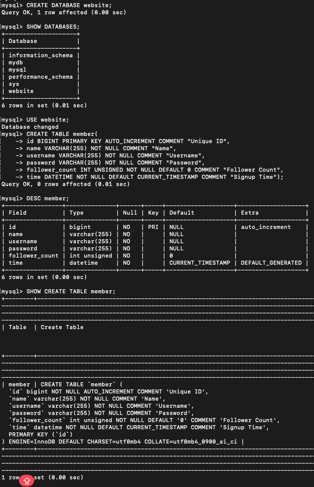
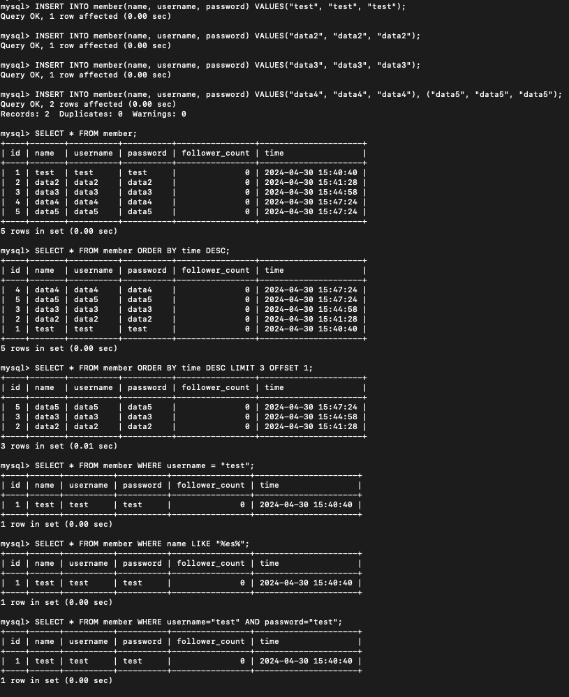
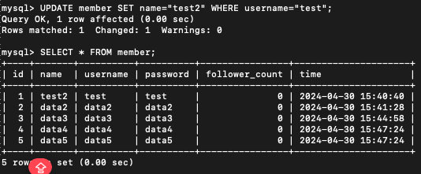
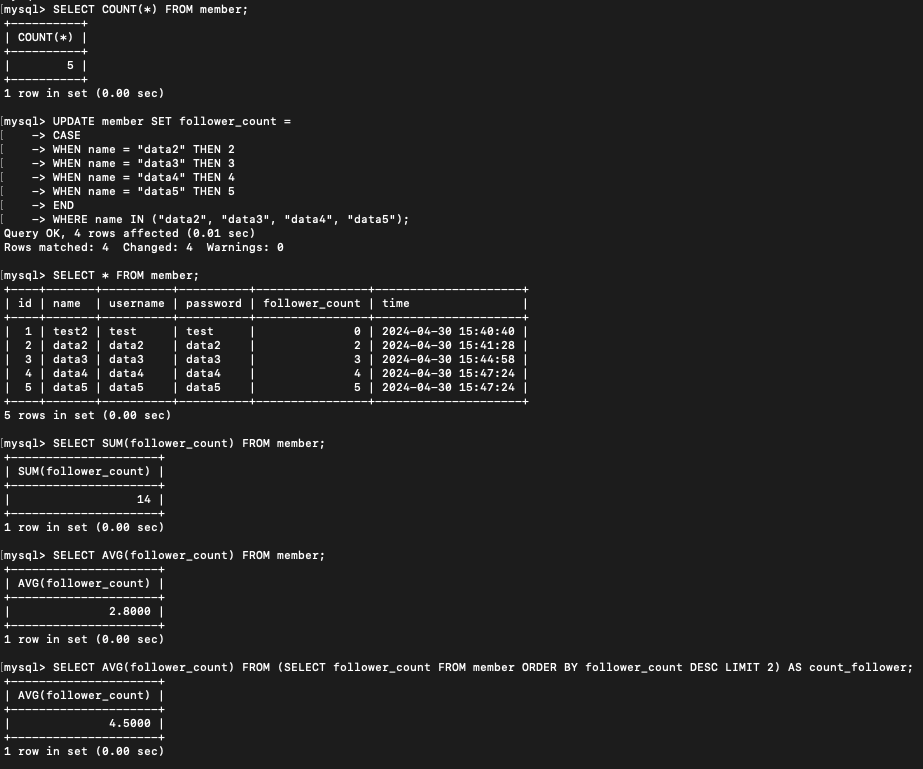
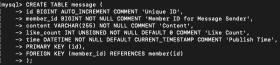
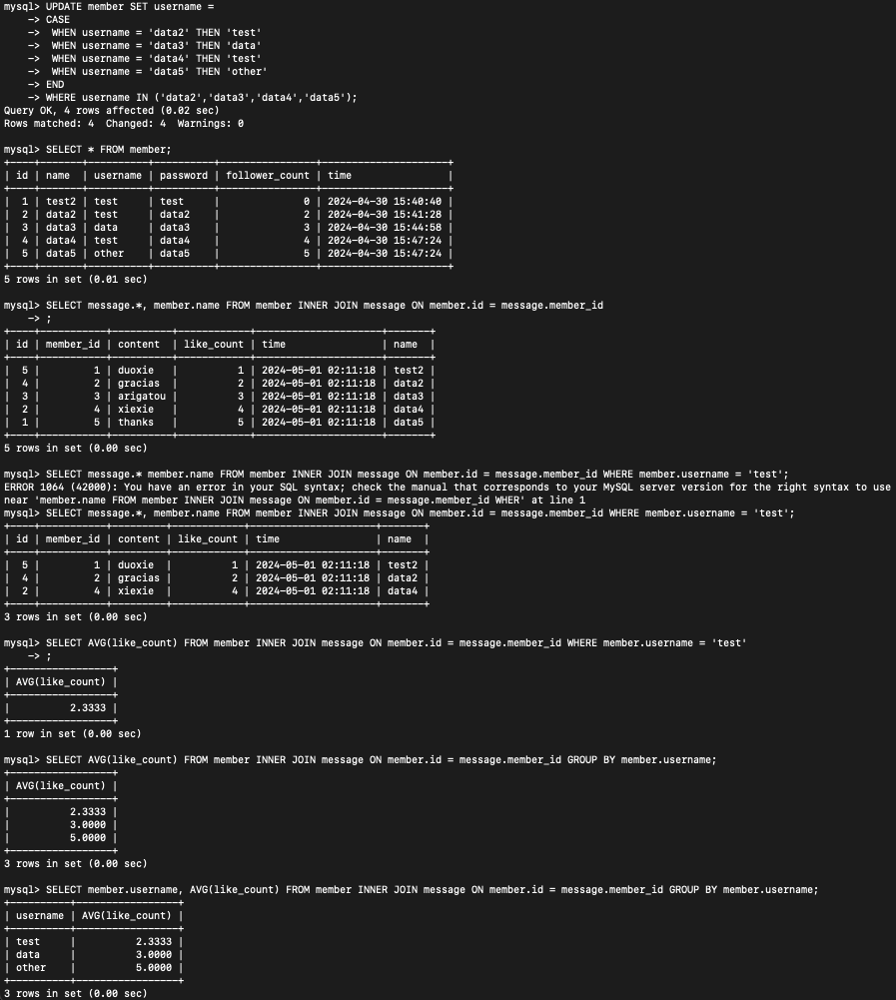

## Task2

- #### Ans.1
> CREATE DATABASE website;

- #### Ans.2
> USE website;  
CREATE TABLE member(  
&nbsp;&nbsp;&nbsp;&nbsp; id BIGINT AUTO_INCREMENT COMMENT 'Unique ID',  
&nbsp;&nbsp;&nbsp;&nbsp; name VARCHAR(255) NOT NULL COMMENT 'Name',  
&nbsp;&nbsp;&nbsp;&nbsp; username VARCHAR(255) NOT NULL COMMENT 'Username',  
&nbsp;&nbsp;&nbsp;&nbsp; password VARCHAR(255) NOT NULL COMMENT 'Password',  
&nbsp;&nbsp;&nbsp;&nbsp; follower_count INT UNSIGNED NOT NULL DEFAULT 0 COMMENT 'Follower Count',  
&nbsp;&nbsp;&nbsp;&nbsp; time DATETIME NOT NULL DEFAULT CURRENT_TIMESTAMP COMMENT 'Signup Time',  
&nbsp;&nbsp;&nbsp;&nbsp; PRIMARY KEY (id)  
);  

:stars: 截圖(Task2)

  

## Task3
- #### Ans.1  
> INSERT INTO member(name, username, password) VALUES  
&nbsp;&nbsp;&nbsp;&nbsp; ('test', 'test', 'test'),  
&nbsp;&nbsp;&nbsp;&nbsp; ('data2', 'data2', 'data2'),  
&nbsp;&nbsp;&nbsp;&nbsp; ('data3', 'data3', 'data3'),  
&nbsp;&nbsp;&nbsp;&nbsp; ('data4', 'data4', 'data4'),  
&nbsp;&nbsp;&nbsp;&nbsp; ('data5', 'data5', 'data5');  　

- #### Ans.2  
> SELECT * FROM member;  

- #### Ans.3  
> SELECT * FROM member ORDER BY time DESC;  

- #### Ans.4   
> SELECT * FROM member ORDER BY time DESC LIMIT 3 OFFSET 1;   

- #### Ans.5  
> SELECT * FROM member WHERE username = 'test';  

- #### Ans.6  
> SELECT * FROM member WHERE name LIKE '%es%';  

- #### Ans.7  
> SELECT * FROM member WHERE username = 'test' AND password = 'test';  

- #### Ans.8  
> UPDATE member SET name = 'test2' WHERE username = 'test';  

:stars: 截圖(Task3)

   

## Task4

- #### Ans.1  
> SELECT COUNT(*) FROM member;  

- #### Ans.2  
> SELECT SUM(follower_count) FROM member;  

- #### Ans.3  
> SELECT AVG(follower_count) FROM member;  

- #### Ans.4  
>  SELECT AVG(follower_count) FROM (SELECT follower_count FROM member ORDER BY follower_count DESC LIMIT 2) AS count_follower;  

:stars: 截圖(Task4)

  

## Task5

- #### Ans.1  
> CREATE TABLE message (  
&nbsp;&nbsp;&nbsp;&nbsp; id BIGINT AUTO_INCREMENT COMMENT 'Unique ID',  
&nbsp;&nbsp;&nbsp;&nbsp; member_id BIGINT NOT NULL COMMENT 'Member ID for Message Sender',  
&nbsp;&nbsp;&nbsp;&nbsp; content VARCHAR(255) NOT NULL COMMENT 'Content',  
&nbsp;&nbsp;&nbsp;&nbsp; like_count INT UNSIGNED NOT NULL DEFAULT 0 COMMENT 'Like Count',  
&nbsp;&nbsp;&nbsp;&nbsp; time DATETIME NOT NULL DEFAULT CURRENT_TIMESTAMP COMMENT 'Publish Time',  
&nbsp;&nbsp;&nbsp;&nbsp; PRIMARY KEY (id),  
&nbsp;&nbsp;&nbsp;&nbsp; FOREIGN KEY (member_id) REFERENCES member(id)  
);

- #### Ans.2  
> SELECT message.*, member.name FROM member INNER JOIN message ON member.id = message.member_id;  

- #### Ans.3  
> SELECT message.*, member.name FROM member INNER JOIN message ON member.id = message.member_id WHERE member.username = 'test';

- #### Ans.4
> SELECT AVG(like_count) FROM member INNER JOIN message ON member.id = message.member_id WHERE member.username = 'test;

- #### Ans.5
> SELECT AVG(like_count) FROM member INNER JOIN message ON member.id = message.member_id GROUP BY member.username;

:stars: 截圖(Task5)

   

 
